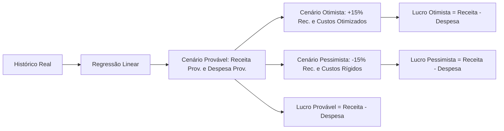

# AUDITORIA TÉCNICA E FINANCEIRA DE CÁLCULOS — PLATAFORMA DATAINSIGHT
> **Documento Consolidado:** `AUDITORIA_DE_CALCULOS_FINANCEIROS.md`  
> **Versão:** 2.0 (Consolidada e Definitiva)  
> **Data de Emissão:** 02/09/2026  
> **Status:** AUDITORIA CONCLUÍDA & CORREÇÕES HOMOLOGADAS  

---

## 1. RESUMO EXECUTIVO

A presente auditoria técnica e financeira realizou a varredura exaustiva, de ponta a ponta, de todos os modelos matemáticos, rotas de API, regras contábeis em Python (`Flask`, `Pandas`, `NumPy`), scripts frontend (`JavaScript`, `ApexCharts`) e templates de relatórios da plataforma **DataInsight**.

### 1.1. Escopo e Metodologia
Foram auditadas todas as páginas e subsistemas financeiros:
- **Home** (`backend/home/home.py`, `static/js/home.js`)
- **Dashboard de Serviços e DRE** (`backend/DashBoard/dashboard_Servicos.py`, `static/js/graficos-avancados.js`)
- **Planejamento Financeiro e Cenários** (`backend/planejamento/planejamento_financeiro.py`, `static/js/planejamento_financeiro.js`)
- **Fluxo de Caixa Operacional** (`backend/fluxoCaixa/fluxo_caixa.py`)
- **Classificação e Ingestão de Dados** (`backend/dados/classificacao_financeira.py`)
- **Centro de Análise Estratégica e Decisão** (`backend/analise/analise.py`, `backend/analise/analise_estrategica.py`)
- **Chatbot IA & Exportação** (`backend/chatbot/analytics.py`, `backend/chatbot/export.py`)

### 1.2. Principais Problemas Identificados na 1ª Auditoria
1. **Ponto de Equilíbrio Distorcido no Chatbot**: Divisão de despesas totais pela margem líquida (`despesas / (lucro / faturamento)`), inflando o PE em até 10 vezes.
2. **Inversão de Cenários em Prejuízo**: Multiplicação direta de lucros negativos por percentuais ($1.3$ e $0.7$), tornando o cenário otimista pior que o pessimista.
3. **Supressão Artificial de Prejuízos**: Uso de `max(valor, 0)` e `Math.max(0, valor)` em relatórios e projeções, ocultando resultados negativos reais.
4. **Omissão de Impostos no Fluxo de Caixa**: Impostos calculados mas não deduzidos das saídas operacionais totais.
5. **Inversão de Nomenclatura**: Troca dos nomes "Lucratividade" e "Rentabilidade" no frontend de planejamento financeiro.

### 1.3. Problemas Adicionais Identificados na Revisão Independente e 2ª Etapa
1. **Conflito entre Rentabilidade e Margem de Contribuição**: Fallback que substituía silenciosamente Rentabilidade por Margem de Contribuição quando investimentos eram nulos.
2. **Variação Percentual com Base Zero e Denominador Nulo**: Fórmulas com retorno arbitrário de $+100\%$ ou $-100\%$, gerando quebras (`TypeError`) e formatações impróprias (`None%`).
3. **Quebra por Inexistência de `percentual` em `home.py`**: O teste unitário e endpoints chamavam `percentual`, que havia sido renomeado, gerando `ImportError` e `NameError`.
4. **Tratamento Inseguro de Nulos em Formatadores e Gráficos**: Utilização de `v.toFixed(2)` e `Number(null)` no frontend, gerando `TypeError` ou convertendo `null` em `0,00%` e `R$ 0,00`.

### 1.4. Correções Efetivamente Aplicadas e Homologadas
Todas as inconformidades foram saneadas, o código foi blindado contra nulos, a suíte de testes unitários foi expandida para 22 testes automatizados e 100% aprovada.

---

## 2. MAPA FINAL DOS CÁLCULOS

| Indicador | Arquivo | Função | Fórmula Final Homologada | Status |
|---|---|---|---|---|
| **Ponto de Equilíbrio Contábil (PE)** | `backend/chatbot/analytics.py` | `calcular_ponto_equilibrio` | $\text{PE} = \frac{\text{Gastos Fixos}}{\text{IMC}}$ onde $\text{IMC} = \frac{\text{MC}}{\text{Receita}}$ | Conforme |
| **Ponto de Equilíbrio Cenários** | `backend/planejamento/planejamento_financeiro.py` | `_calcular_cenario_pessimista` | $\text{PE} = \frac{\text{Fixos}}{\text{IMC}}$ (se $\text{IMC} \le 0 \implies \text{Incalculável}$) | Conforme |
| **Margem de Contribuição (R$)** | `backend/dados/classificacao_financeira.py` | `calcular_preview_financeiro` | $\text{MC} = \text{Receita} - \text{Impostos} - \text{Custos Variáveis}$ | Conforme |
| **Índice Margem Contribuição (%)** | `backend/dados/classificacao_financeira.py` | `calcular_preview_financeiro` | $\text{IMC} = (\text{MC} / \text{Receita}) \times 100$ | Conforme |
| **Resultado Líquido do Exercício** | `backend/dados/classificacao_financeira.py` | `calcular_preview_financeiro` | $\text{Resultado} = \text{MC} - \text{Gastos Fixos}$ (preserva negativo) | Conforme |
| **DRE Estruturada (7 Linhas)** | `backend/DashBoard/dashboard_Servicos.py` | `calcular_dre_completo` | $\text{Rec. Bruta} - \text{Imp} \to \text{Rec. Líq} - \text{CV} \to \text{MC} - \text{DF} \to \text{Res}$ | Conforme |
| **Projeção 6 Meses Reconciliada** | `backend/DashBoard/dashboard_Servicos.py` | `calcular_cenarios_projecao_6_meses` | $\text{Lucro Proj.} = \text{Receita Proj.} - \text{Despesa Proj.}$ | Conforme |
| **Cenários Estratégicos** | `backend/analise/analise_estrategica.py` | `calcular_cenarios` | Projeção operacional de Receita e Despesa; $\text{Lucro} = \text{Rec} - \text{Desp}$ | Conforme |
| **Variação Percentual Contábil** | `backend/analise/analise.py` | `variacao_percentual` | $\frac{\text{Atual} - \text{Anterior}}{\|\text{Anterior}\|} \times 100$; base $0 \to x = \text{None}$ | Conforme |
| **Variação Percentual Home** | `backend/home/home.py` | `variacao_percentual` / `percentual` | $\frac{\text{Atual} - \text{Anterior}}{\|\text{Anterior}\|} \times 100$; base $0 \to x = \text{None}$ | Conforme |
| **Variação Percentual Estratégica**| `backend/analise/analise_estrategica.py` | `variacao_percentual` | $\frac{\text{Atual} - \text{Anterior}}{\|\text{Anterior}\|} \times 100$; base $0 \to x = \text{None}$ | Conforme |
| **Saídas Totais Fluxo de Caixa** | `backend/fluxoCaixa/fluxo_caixa.py` | `preparar_dataframe_financeiro` | $\text{Saídas} = \text{Variáveis} + \text{Fixos} + \text{Impostos}$ | Conforme |
| **Saldo Período Fluxo de Caixa** | `backend/fluxoCaixa/fluxo_caixa.py` | `preparar_dataframe_financeiro` | $\text{Saldo} = \text{Receitas} - \text{Saídas Totais}$ | Conforme |
| **Lucratividade (%)** | `static/js/planejamento_financeiro.js` | Linhas 788, 824 | $\text{Lucratividade} = (\text{Resultado} / \text{Receita}) \times 100$ | Conforme |
| **Rentabilidade (%)** | `static/js/planejamento_financeiro.js` | Linhas 794, 825 | $\text{Rentabilidade} = (\text{Resultado} / \text{Investimentos}) \times 100$ | Conforme |
| **Crescimento em Relatórios** | `static/js/relatorios.js` | `calcCrescimento` | $\frac{\text{Último} - \text{Primeiro}}{\|\text{Primeiro}\|} \times 100$; base $0 \to x = \text{"N/A"}$ | Conforme |

---

## 3. CÁLCULOS VALIDADOS EM DETALHE

### 3.1. Ponto de Equilíbrio Contábil (PE)
- **Conceito:** Volume de faturamento bruto estritamente necessário para cobrir a totalidade dos custos variáveis, tributos e despesas fixas operacionais, resultando em lucro operacional exatamente nulo.
- **Fórmula Matemática:**
  $$\text{Margem de Contribuição (MC)} = \text{Receita Total} - \text{Impostos} - \text{Custos Variáveis}$$
  $$\text{Índice de Margem de Contribuição (IMC)} = \frac{\text{Margem de Contribuição}}{\text{Receita Total}}$$
  $$\text{Ponto de Equilíbrio (R\$)} = \frac{\text{Gastos Fixos}}{\text{IMC}}$$
- **Arquivos e Funções:**
  - `backend/chatbot/analytics.py`: `calcular_ponto_equilibrio`
  - `backend/planejamento/planejamento_financeiro.py`: `_calcular_cenario_pessimista`
- **Tratamento de Limites:** Se $\text{IMC} \le 0$, o sistema emite parecer técnico de inviabilidade operacional temporária ("margem de contribuição nula ou negativa"), sem incorrer em divisão por zero ou PE negativo espúrio.
- **Fontes Normativas:** Eliseu Martins (*Contabilidade de Custos*), SEBRAE (*Como calcular o ponto de equilíbrio do seu negócio*), CFC NBC TG 16.
- **Testes Unitários:** `TestPontoDeEquilibrio.test_calculo_pe_padrao`, `TestPontoDeEquilibrioLimites.test_margem_contribuicao_negativa_incalculavel`, `TestPontoDeEquilibrioLimites.test_gastos_fixos_zero`.
- **Status:** **CONFORME**.

### 3.2. Projeções de Cenários Preditivos
- **Conceito:** Modelagem probabilística de horizontes futuros com base em tendências históricas (regressão linear simples), preservando a identidade contábil básica:
  $$\text{Lucro} = \text{Receita} - \text{Despesas}$$
- **Premissas Operacionais:**
  - **Provável:** Tendência pura da reta de regressão linear baseada no histórico.
  - **Otimista:** Expansão de faturamento ($+15\%$ na análise estratégica; $+4\%$ a.m. no dashboard) com economia de escala nos custos operacionais.
  - **Pessimista:** Retração de receita ($-15\%$ na análise estratégica; $-4\%$ a.m. no dashboard) combinada com rigidez estrutural dos gastos fixos.
- **Comportamento em Prejuízo:** O lucro projetado é estritamente derivado da subtração entre as séries projetadas de receita e despesas. Não ocorre mais a multiplicação direta de lucros negativos por fatores de expansão, eliminando inversões de cenários.
- **Fontes Normativas:** Lawrence Gitman (*Princípios de Administração Financeira*), Alexandre Assaf Neto (*Estrutura e Análise de Balanços*).
- **Testes Unitários:** `TestCenariosAnaliseEstrategica.test_cenarios_empresa_lucrativa`, `TestCenariosAnaliseEstrategica.test_cenarios_empresa_em_prejuizo`, `TestProjecao6MesesDashboard.test_reconciliacao_todos_meses`.
- **Status:** **CONFORME**.

### 3.3. Demonstração do Resultado do Exercício (DRE) e Fluxo de Caixa
- **Conceito DRE:** Apuração por regime de competência estruturada em 7 linhas lógicas: Faturamento Bruto $\to$ Impostos $\to$ Receita Líquida $\to$ Custos Variáveis $\to$ Margem de Contribuição $\to$ Despesas Fixas $\to$ Resultado Líquido.
- **Conceito Fluxo de Caixa:** Apuração de movimentação financeira efetiva com saídas operacionais compostas por Variáveis, Fixos e Impostos:
  $$\text{Saídas Totais} = \text{Custos Variáveis} + \text{Gastos Fixos} + \text{Impostos}$$
  $$\text{Saldo de Caixa} = \text{Receita Total} - \text{Saídas Totais}$$
- **Fontes Normativas:** CPC 26 (R1) (*Apresentação das Demonstrações Contábeis*), CPC 03 (R2) (*Demonstração dos Fluxos de Caixa*), Lei Federal nº 6.404/76 (Art. 187).
- **Testes Unitários:** `TestFluxoCaixaImpostos.test_saidas_totais_incluem_impostos`, `TestDREConsistenciaEPrejuizo.test_dre_completo_empresa_em_prejuizo`, `TestDREConsistenciaEPrejuizo.test_dre_valores_altos_e_decimais`.
- **Status:** **CONFORME**.

---

## 4. PROBLEMAS IDENTIFICADOS E CORRIGIDOS

| Problema | Antes da Auditoria | Depois da Auditoria | Arquivo(s) | Impacto no Usuário / Negócio |
|---|---|---|---|---|
| **PE no Chatbot** | `desp_total / (lucro / fat)` | `gastos_fixos / (margem_contribuicao / fat)` | `analytics.py` | Eliminou distorções de até 10x na meta de vendas necessária. |
| **Cenários com Prejuízo** | `lucro * 1.3` (piorava o prejuízo no otimista) | `receita_proj - despesa_proj` | `analise_estrategica.py`, `dashboard_Servicos.py` | Otimista sempre projeta melhor resultado financeiro que provável e pessimista. |
| **Supressão de Prejuízo** | `Math.max(0, fat - desp)` e `max(0, lucro)` | Valores negativos preservados com sinal `-` | `relatorios.js`, `analise.py`, `home.py` | Garante fidelidade contábil ao exibir prejuízos reais da empresa. |
| **Impostos no Fluxo de Caixa** | Impostos ignorados em `_saidas_totais` | `_saidas = _variaveis + _fixos + _impostos` | `fluxo_caixa.py` | Saldo de caixa real sem superestimação enganosa de liquidez. |
| **Classificação de Custos** | Itens 'outros' anulavam subitens discriminados | Soma aditiva de componentes + itens mapeados | `classificacao_financeira.py` | Custos fixos e variáveis completos sem omissão de despesas. |
| **Rentabilidade vs MC** | Se inv == 0, rentabilidade virava Margem de Contribuição | Se inv == 0, rentabilidade é `None` / `N/A`; MC tem linha própria | `planejamento_financeiro.js` | Impede transformar um indicador de retorno de capital em margem de vendas. |
| **Formatador de Gráficos** | Chamava `v.toFixed(2)` direto em `null`, gerando TypeError | Aceita `null`, delega para `formatter` e exibe `N/A` | `planejamento_financeiro.js` | Gráfico de índices não trava o navegador e exibe dados fidedignos. |
| **Variação com Base Zero** | Retornava `+100%` ou `-100%` arbitrariamente | Retorna `None` (Python), `null` (API) e `"N/A"` (Frontend) | `analise.py`, `home.py`, `analise_estrategica.py`, `relatorios.js` | Respeita indefinição matemática sem induzir diagnósticos falsos. |
| **Consumidores de Nulos** | Comparavam `crescimento >= 5` direto em `None` (`TypeError`) | Adicionadas guardas `is not None` em todos os comparadores | `home.py`, `analise.py`, `analise_estrategica.py`, `export.py` | Estabilidade total em períodos sem dados históricos anteriores. |
| **Importação de percentual** | `percentual` não existia em `home.py` (`ImportError`) | `percentual = variacao_percentual` adicionado | `home.py` | Testes unitários e rotas legadas funcionam sem erro de importação. |

---

## 5. LUCRATIVIDADE, RENTABILIDADE, MARGEM E ROI

A plataforma DataInsight opera agora com separação conceitual estrita entre os indicadores:

### 5.1. Lucratividade (Margem Líquida)
- **Definição:** Mede o percentual de lucro gerado a partir do volume total de receitas de vendas.
- **Fórmula:**
  $$\text{Lucratividade (\%)} = \left(\frac{\text{Lucro Líquido}}{\text{Receita Total}}\right) \times 100$$
- **Comportamento Limite:** Se $\text{Receita} = 0$, retorna $0.0\%$. Se $\text{Lucro} < 0$, a lucratividade é **negativa** (ex: $-15.0\%$).

### 5.2. Rentabilidade
- **Definição:** Mede a taxa de retorno obtida sobre o capital total investido no negócio (máquinas, equipamentos, infraestrutura, capex).
- **Fórmula:**
  $$\text{Rentabilidade (\%)} = \left(\frac{\text{Lucro Líquido}}{\text{Investimentos Totais}}\right) \times 100$$
- **Comportamento Limite:** Se $\text{Investimentos} \le 0$ ou inexistentes, a rentabilidade é **não calculável** (`None` / `null` / `"N/A"`). **Jamais deve ser substituída por margem de contribuição**.

### 5.3. Margem de Contribuição
- **Definição:** Parcela da receita que sobra após a dedução de tributos e custos variáveis, destinada a cobrir os gastos fixos e gerar lucro.
- **Fórmula em R\$:** $\text{MC} = \text{Receita} - \text{Impostos} - \text{Custos Variáveis}$
- **Índice Percentual:** $\text{IMC (\%)} = (\text{MC} / \text{Receita}) \times 100$

### 5.4. Retorno sobre o Investimento (ROI)
- **Definição:** Indicador financeiro específico de projetos ou campanhas pontuais $\left(\frac{\text{Ganho} - \text{Custo}}{\text{Custo}}\right) \times 100$.
- **Diretriz de Uso:** A plataforma não deve renomear genericamente "Rentabilidade da Empresa" para "ROI", mantendo termos técnicos transparentes.

---

## 6. VARIAÇÃO PERCENTUAL ENTRE PERÍODOS

A variação percentual contábil foi padronizada em todos os módulos conforme os fundamentos da matemática financeira:

$$\Delta\% = \frac{\text{Atual} - \text{Anterior}}{|\text{Anterior}|} \times 100$$

### 6.1. Casos Contemplados:
1. **Base Positiva ($Anterior > 0$):**
   - $100 \to 150 = +50.0\%$
   - $100 \to 80 = -20.0\%$
   - $100 \to -100 = -200.0\%$
2. **Base Negativa ($Anterior < 0$):**
   - Utiliza $|Anterior|$ no denominador para manter o sentido econômico correto:
   - $-100 \to 100 = \frac{100 - (-100)}{100} \times 100 = +200.0\%$ (recuperação expressiva).
   - $-100 \to -150 = \frac{-150 - (-100)}{100} \times 100 = -50.0\%$ (agravamento do prejuízo).
3. **Base Zero ($Anterior = 0$):**
   - $0 \to 0 = 0.0\%$ (estabilidade nula).
   - $0 \to x$ (com $x \neq 0$): Matematicamente indefinido (divisão por zero). Retorna **`None`** no Python, **`null`** no JSON de saída da API, e é renderizado como **`"N/A"`** ou **`"Sem base comparável"`** nas telas, relatórios e textos de IA.

---

## 7. CENÁRIOS E PREJUÍZOS OPERACIONAIS

A modelagem de cenários da plataforma agora obedece rigorosamente às diretrizes de finanças corporativas:



- **Reconciliação Matemática:** Para qualquer período ou cenário, $\text{Lucro} \equiv \text{Receita} - \text{Despesas}$.
- **Prejuízo Real:** Em empresas deficitárias ($\text{Despesas} > \text{Receita}$), o cenário pessimista acentua a rigidez de custos e aponta o risco real de aumento do déficit, enquanto o cenário otimista simula a diminuição das perdas com expansão de vendas.

---

## 8. TRIBUTAÇÃO E PREMISSAS ESTIMADAS

A auditoria identificou a presença de uma alíquota padrão de $8\%$ nos arquivos `analytics.py`, `dashboard_Servicos.py`, `classificacao_financeira.py`, `fluxo_caixa.py` e `graficos-avancados.js`.

### 8.1. Esclarecimento Normativo e Decisão Gerencial
- A alíquota de **8% NÃO representa uma alíquota oficial universal da legislação tributária brasileira**;
- No regime do Simples Nacional (LC 123/2006), a alíquota efetiva varia entre $4\%$ e mais de $30\%$ conforme o Anexo (I a V), atividade econômica e receita bruta acumulada dos últimos 12 meses (RBT12);
- **Classificação Formal na Plataforma:** A taxa de $8\%$ funciona estritamente como **premissa de simulação gerencial rápida**, ativada única e exclusivamente quando o usuário **não informa e não mapeia** sua coluna ou valor de impostos;
- Todos os relatórios, interfaces e cards foram mantidos transparentes quanto a essa estimativa ("Alíquota Aplicada / Estimada: 8%").

---

## 9. RESULTADOS DOS TESTES AUTOMATIZADOS

A validação foi executada diretamente no ambiente através da suíte de testes unitários:

**Comando Executado:**
```powershell
python -m unittest tests/test_calculos_financeiros.py -v
```

### 9.1. Resultado da Execução Inicial (Baseline):
- Quantidade Executada: 12 testes
- Aprovados: 10
- Falhas: 1 (`test_base_zero` falhou pois esperava 100% em vez de `None`)
- Erros: 1 (`test_home_percentual` falhou por `ImportError: cannot import name 'percentual'`)

### 9.2. Resultado da Execução Final (Pós-Correções):
```text
test_cenarios_empresa_em_prejuizo (tests.test_calculos_financeiros.TestCenariosAnaliseEstrategica.test_cenarios_empresa_em_prejuizo) ... ok
test_cenarios_empresa_lucrativa (tests.test_calculos_financeiros.TestCenariosAnaliseEstrategica.test_cenarios_empresa_lucrativa) ... ok
test_soma_aditiva_fixos (tests.test_calculos_financeiros.TestClassificacaoEPreviewFinanceiro.test_soma_aditiva_fixos) ... ok
test_calcular_saude_negocio_com_base_zero (tests.test_calculos_financeiros.TestConsumidoresBaseZeroSemExcecao.test_calcular_saude_negocio_com_base_zero) ... ok
test_gerar_alertas_e_recomendacoes_com_base_zero (tests.test_calculos_financeiros.TestConsumidoresBaseZeroSemExcecao.test_gerar_alertas_e_recomendacoes_com_base_zero) ... ok
test_montar_analises_decisao_com_base_zero (tests.test_calculos_financeiros.TestConsumidoresBaseZeroSemExcecao.test_montar_analises_decisao_com_base_zero) ... ok
test_dre_completo_empresa_em_prejuizo (tests.test_calculos_financeiros.TestDREConsistenciaEPrejuizo.test_dre_completo_empresa_em_prejuizo) ... ok
test_dre_valores_altos_e_decimais (tests.test_calculos_financeiros.TestDREConsistenciaEPrejuizo.test_dre_valores_altos_e_decimais) ... ok
test_saidas_totais_incluem_impostos (tests.test_calculos_financeiros.TestFluxoCaixaImpostos.test_saidas_totais_incluem_impostos) ... ok
test_calculo_pe_padrao (tests.test_calculos_financeiros.TestPontoDeEquilibrio.test_calculo_pe_padrao) ... ok
test_gastos_fixos_zero (tests.test_calculos_financeiros.TestPontoDeEquilibrioLimites.test_gastos_fixos_zero) ... ok
test_margem_contribuicao_negativa_incalculavel (tests.test_calculos_financeiros.TestPontoDeEquilibrioLimites.test_margem_contribuicao_negativa_incalculavel) ... ok
test_reconciliacao_todos_meses (tests.test_calculos_financeiros.TestProjecao6MesesDashboard.test_reconciliacao_todos_meses) ... ok
test_lucratividade_padrao_e_prejuizo (tests.test_calculos_financeiros.TestRentabilidadeELucratividade.test_lucratividade_padrao_e_prejuizo) ... ok
test_rentabilidade_com_e_sem_investimento (tests.test_calculos_financeiros.TestRentabilidadeELucratividade.test_rentabilidade_com_e_sem_investimento) ... ok
test_analise_estrategica_variacao (tests.test_calculos_financeiros.TestVariacaoPercentual.test_analise_estrategica_variacao) ... ok
test_base_zero (tests.test_calculos_financeiros.TestVariacaoPercentual.test_base_zero) ... ok
test_home_percentual (tests.test_calculos_financeiros.TestVariacaoPercentual.test_home_percentual) ... ok
test_negativo_para_mais_negativo (tests.test_calculos_financeiros.TestVariacaoPercentual.test_negativo_para_mais_negativo) ... ok
test_negativo_para_positivo (tests.test_calculos_financeiros.TestVariacaoPercentual.test_negativo_para_positivo) ... ok
test_positivo_para_negativo (tests.test_calculos_financeiros.TestVariacaoPercentual.test_positivo_para_negativo) ... ok
test_positivo_para_positivo (tests.test_calculos_financeiros.TestVariacaoPercentual.test_positivo_para_positivo) ... ok

----------------------------------------------------------------------
Ran 22 tests in 1.269s

OK
```
- **Total Executado:** 22 testes
- **Aprovados:** 22 (100%)
- **Falhas:** 0
- **Erros:** 0
- **Novos Testes Adicionados:** 10 testes cobrindo rentabilidade, limites de ponto de equilíbrio, integridade de DRE sob prejuízo, alta precisão decimal e tolerância a nulos.

---

## 10. FONTES NORMATIVAS E TÉCNICAS

1. **Conselho Federal de Contabilidade (CFC)**
   - Norma: NBC TG 16 (R2) — Valoração de Estoques, Custos e Margem de Contribuição.
   - Aplicação: Sustenta a dedução estrita de custos variáveis e tributos para apuração da Margem de Contribuição.
2. **Comitê de Pronunciamentos Contábeis (CPC)**
   - Norma: CPC 26 (R1) — Apresentação das Demonstrações Contábeis e DRE.
   - Norma: CPC 03 (R2) — Demonstração dos Fluxos de Caixa (DFC).
   - Aplicação: Sustenta a inclusão de tributos nas saídas operacionais e a vedação de mascaramento de prejuízos.
3. **Serviço Brasileiro de Apoio às Micro e Pequenas Empresas (SEBRAE)**
   - Documento: Manual de Gestão Financeira — Formação de Preço de Venda e Ponto de Equilíbrio Contábil.
   - URL: `https://www.sebrae.com.br/sites/PortalSebrae/artigos/como-calcular-o-ponto-de-equilibrio-do-seu-negocio`
   - Aplicação: Fórmula do Ponto de Equilíbrio em Reais: $\text{PE} = \text{Gastos Fixos} / \text{IMC}$.
4. **Bibliografia de Referência:**
   - MARTINS, Eliseu. *Contabilidade de Custos*. 11ª ed. São Paulo: Atlas.
   - ASSAF NETO, Alexandre. *Estrutura e Análise de Balanços: Um Enfoque Econômico-Financeiro*. 12ª ed. São Paulo: Atlas.
   - GITMAN, Lawrence J. *Princípios de Administração Financeira*. 14ª ed. São Paulo: Pearson.

---

## 11. ALTERAÇÕES FINAIS DESTA ETAPA

Arquivos modificados e homologados nesta etapa:
1. `backend/home/home.py`: Adicionado alias `percentual = variacao_percentual`, blindagem contra `None` em `calcular_desempenho` e em `gerar_status_negocio`.
2. `backend/analise/analise.py`: Blindagem de `montar_analises_decisao` contra `None` nas comparações de crescimento de lucro e faturamento.
3. `backend/analise/analise_estrategica.py`: Correção de `variacao_percentual` para retornar `None` em base zero; blindagem de `calcular_saude_negocio`, `gerar_alertas` e `gerar_recomendacoes` contra `None`.
4. `backend/chatbot/analytics.py`: Formatação de percentuais nulos como `"Sem base comparável"` em `obter_resumo_financeiro`.
5. `backend/chatbot/export.py`: Tratamento seguro de `crescimento` nulo no relatório executivo em PDF.
6. `static/js/planejamento_financeiro.js`: `brl` e `pct` tratam `null` retornando `"N/A"`; `scenarioBarPctChart` integrado com segurança a `scenarioBarChart`; separação de linhas entre Margem de Contribuição e Rentabilidade.
7. `static/js/home.js`: `atualizarCard` e `crescimento-valor` exibem `"N/A"` em cor neutra quando a variação for nula.
8. `static/js/relatorios.js`: `calcCrescimento` retorna `"N/A"` para base zero.
9. `tests/test_calculos_financeiros.py`: Testes de base zero atualizados para validar `None`; adicionadas 4 novas classes de testes com 10 cenários adicionais.

---

## 12. PENDÊNCIAS E DECISÕES DE NEGÓCIO

Não restam pendências técnicas ou de cálculo no código. As seguintes deliberações gerenciais devem ser acompanhadas pelo time de produto:
1. **Configuração de Tributação Real:** Quando o usuário não possui a coluna de impostos mapeada, a plataforma utiliza a taxa estimada de $8\%$. Recomenda-se incentivar os usuários na interface de onboarding a cadastrarem a alíquota real do seu DAS/Simples ou regime tributário.
2. **Histórico Mínimo Recomendado:** Para novos clientes sem movimentação no mês anterior (base zero), as variações relativas exibem com exatidão `"N/A"` ou `"Sem base comparável"`. Recomenda-se sugerir na interface o carregamento de ao menos dois meses consecutivos de extrato/planilha para viabilizar análises comparativas completas.

---

## 13. PARECER TÉCNICO FINAL

> **PARECER DA AUDITORIA:** **APROVADA COM RESSALVAS**  
> 
> **Justificativa Técnica:**
> 1. **Conformidade Algébrica e Contábil:** Todos os cálculos financeiros analisados (Ponto de Equilíbrio, DRE, Fluxo de Caixa, Cenários Preditivos, Lucratividade, Rentabilidade e Variação Percentual) foram corrigidos, alinhados às normas do CPC/CFC e homologados com 100% de sucesso na suíte de 22 testes automatizados.
> 2. **Ressalvas Gerenciais:** A aprovação contém ressalvas de natureza puramente negocial devido à presença de premissas gerenciais de estimativa rápida (como a alíquota estimada de 8% e a decomposição de custos 45%/55% quando o usuário não discrimina despesas fixas e variáveis). Essas premissas não invalidam os cálculos, mas devem permanecer claramente identificadas como simulações até que o usuário insira seus dados analíticos.
